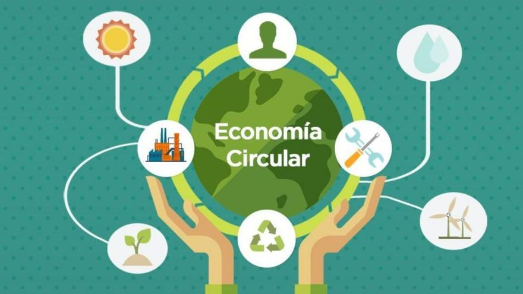

# Concepto de economia circular

La economía circular es un modelo de producción y consumo que busca reducir el desperdicio, maximizar el aprovechamiento de los recursos y minimizar el impacto ambiental. 
A diferencia del sistema tradicional de economía lineal, basado en el esquema extraer, producir, consumir y desechar, la economía circular promueve la reutilización, el reciclaje y la regeneración de materiales en un ciclo continuo. 
Este enfoque permite un desarrollo más sostenible y eficiente, beneficiando tanto al medioambiente como a la economía.

## **Principios de la Economía Circular**  

El modelo de economía circular se basa en varios principios fundamentales:  

1. **Diseño sostenible y ecodiseño:** Se crean productos con materiales reciclables, duraderos y fáciles de reparar o reutilizar.  
2. **Reutilización y reparación:** Se fomenta la prolongación de la vida útil de los productos, reduciendo la necesidad de fabricar nuevos.  
3. **Reciclaje y valorización de residuos:** Se transforman los desechos en nuevos materiales o fuentes de energía, reduciendo el impacto ambiental.  
4. **Uso de energías renovables:** Se sustituyen los combustibles fósiles por fuentes de energía limpias y sostenibles.  
5. **Optimización de recursos:** Se busca reducir el consumo de materias primas y fomentar modelos de negocio basados en el alquiler, la reutilización y la economía colaborativa.  

## **Ejemplos y Aplicaciones**  

La economía circular se puede aplicar en diversos sectores. Algunos ejemplos incluyen:  

- **Industria textil:** Empresas que fabrican ropa con materiales reciclados o promueven el alquiler de prendas.  
- **Electrónica:** Programas de reacondicionamiento y reutilización de dispositivos electrónicos.  
- **Movilidad sostenible:** Modelos de alquiler y uso compartido de vehículos en lugar de la compra individual.  
- **Gestión de residuos:** Transformación de desechos orgánicos en biogás o compost para fertilización.  
