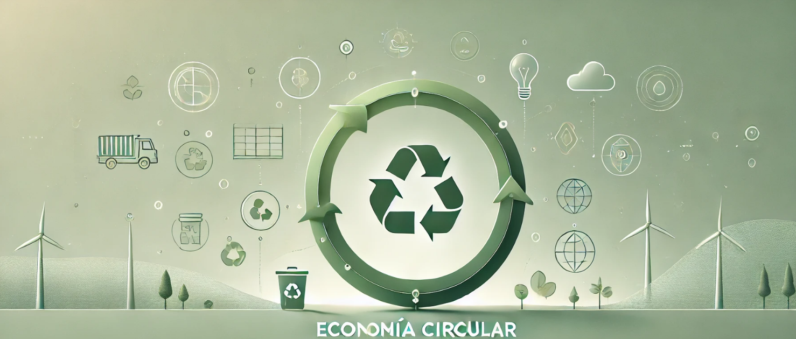

## **Conclusión**  

La economía circular se presenta como una alternativa viable y necesaria frente al modelo de producción y consumo tradicional, que genera un gran impacto ambiental y agota los recursos naturales. 
A través de estrategias como la reutilización, el reciclaje y el ecodiseño, este enfoque busca reducir el desperdicio y optimizar el uso de los materiales, promoviendo un desarrollo sostenible.  

Adoptar este modelo no solo contribuye a la preservación del medioambiente, sino que también genera beneficios económicos y sociales, impulsando la innovación, creando empleos verdes y concienciando a la sociedad sobre un consumo más responsable. 
Para lograr una transición efectiva, es fundamental la colaboración entre gobiernos, empresas y ciudadanos, fomentando políticas sostenibles y un cambio en los hábitos de consumo.  

