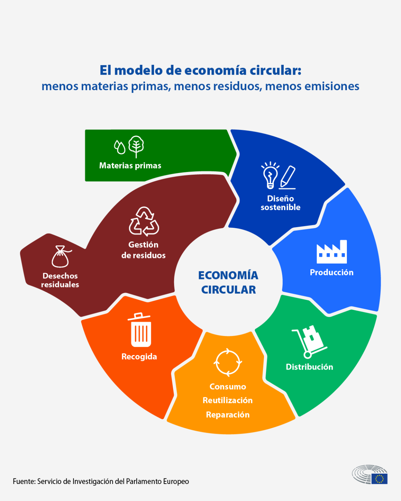

## Economía Circular: Definición, Importancia y Beneficios

### ¿Qué es la economía circular?  
La economía circular es un modelo económico que busca reducir el desperdicio y aprovechar los recursos al máximo. Su enfoque principal es cerrar el ciclo de vida de los productos mediante el reciclaje, la reutilización y la regeneración de materiales. A diferencia de la economía lineal (producir, usar y desechar), este sistema promueve un uso más sostenible de los recursos naturales.

### Importancia  
Este modelo es crucial para enfrentar desafíos globales como la escasez de recursos, el cambio climático y la contaminación. La economía circular contribuye a disminuir la presión sobre el medio ambiente y a fomentar un crecimiento económico sostenible.

### Beneficios  
1. **Ambientales**: Reducción de emisiones de CO₂, conservación de recursos naturales y disminución de residuos.  
2. **Económicos**: Promoción de la innovación, creación de empleos verdes y ahorro en costes de producción.  
3. **Sociales**: Mejora de la calidad de vida y mayor concienciación sobre el impacto ambiental.

### Conclusión  
Adoptar la economía circular no solo es una necesidad ambiental, sino también una oportunidad para transformar la economía hacia un modelo más sostenible y beneficioso para todos.
