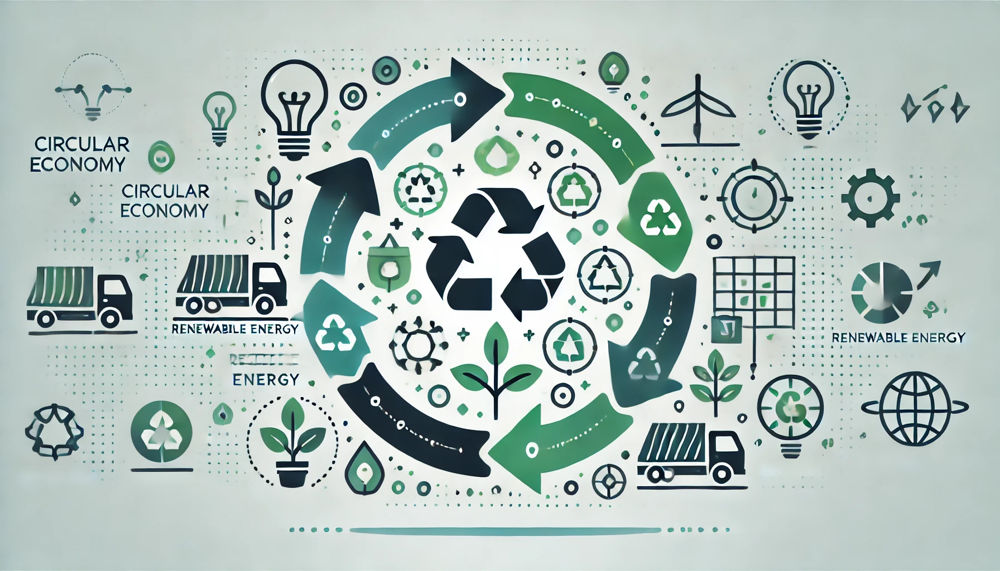

# Introduccion

Hoy en dia algo que no podemos ignorar que nuestros actuales sistemas de produccion y ciclos de vida de los productos son, cuanto menos, dañinas para el mundo. 
Y con estos sistemas me refiero a todo el consumismo basado en producir, usar y desechar, generando y acumulando basura, y gastando y acabando con los recursos que hay que hay en el mundo.
Es por ello imprescindible que comencemos a buscar soluciones a este sistema consumista, y asi eliminar este ciclo de malgasto de recursos y de generacion de desechos. En este trabajo hablamos sobre la conocida
economia circular, una de las soluciones a esta problematica.

